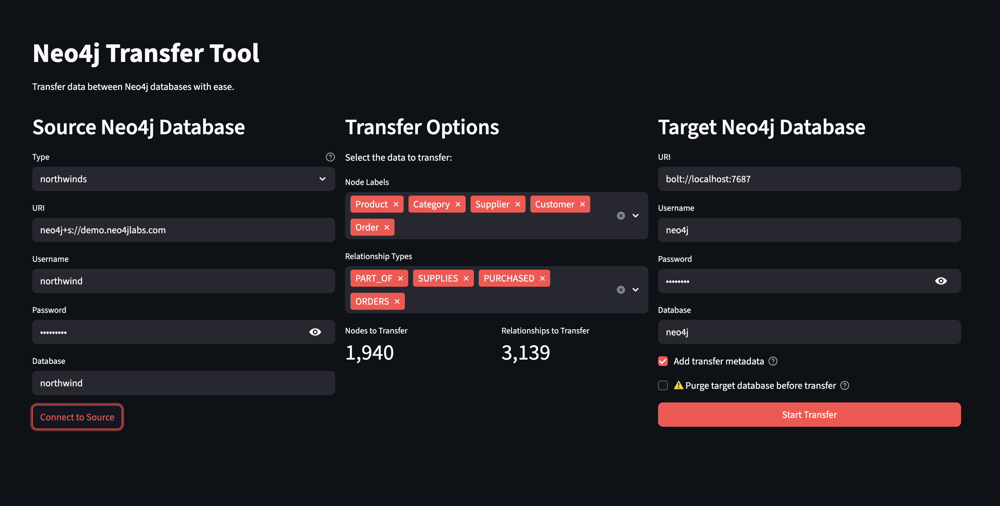

# Neo4j Transfer Streamlit

A powerful, user-friendly Streamlit application for transferring nodes and relationships between Neo4j databases. This tool provides an intuitive web interface for database migration, data synchronization, and selective data transfer operations.



*Example transfer from neo4j.com's Northwinds dataset to a local database instance*

## 🚀 Features

- **Batch Transfer**: Efficiently transfers large datasets using optimized Cypher UNWIND operations
- **Selective Transfer**: Choose specific node labels and relationship types to transfer
- **Real-time Progress**: Visual feedback during transfer operations
- **Transfer History**: Track and manage all transfer operations within a session
- **Undo Functionality**: Safely rollback transfers with one-click undo
- **Database Purge**: Option to clear target database before transfer
- **Multiple Database Support**: Works with Neo4j Aura, Neo4j Desktop, and self-hosted instances
- **Advanced Options**: Customizable transfer properties and metadata tracking

## 🏗️ Architecture

This application leverages the [`neo4j-transfer`](https://pypi.org/project/neo4j-transfer/) package, which provides:
- **Performance**: Faster than individual MATCH/MERGE operations
- **Efficiency**: No dependency on APOC library
- **Scalability**: Optimized for large dataset transfers
- **Reliability**: Built-in error handling and validation

## 📋 Prerequisites

- **Python 3.11+**
- **Poetry** - Python dependency management
- **Neo4j Database** - Source and/or target Neo4j instance(s)

## 🛠️ Installation

### 1. Clone the Repository
```bash
git clone <repository-url>
cd neo4j-transfer-streamlit
```

### 2. Install Dependencies
```bash
poetry install
```

### 3. Environment Configuration
Create a `.env` file in the project root with your Neo4j credentials:

```env
# Source Database (optional - can be configured in UI)
NEO4J_URI=neo4j://localhost:7687
NEO4J_USERNAME=neo4j
NEO4J_PASSWORD=your_password
NEO4J_DATABASE=neo4j

# Target Database (optional - can be configured in UI)
TARGET_NEO4J_URI=neo4j://localhost:7687
TARGET_NEO4J_USERNAME=neo4j
TARGET_NEO4J_PASSWORD=your_password
TARGET_NEO4J_DATABASE=neo4j
```

## 🚀 Usage

### Local Development
```bash
poetry run streamlit run neo4j_transfer_streamlit/main.py
```

### Cloud Deployment
A live version is available at: [https://neo4j-transfer.streamlit.app](https://neo4j-transfer.streamlit.app)

> **Note**: The cloud version cannot connect to local Neo4j instances (e.g., Neo4j Desktop). Use local installation for local database transfers.

## ⚙️ Configuration

### Database Connections

The application supports multiple connection methods:

1. **Environment Variables**: Set credentials in `.env` file
2. **Public Credentials**: Use predefined demo databases
3. **Manual Input**: Enter credentials directly in the UI

### Pre-configured Demo Databases

- **Northwind**: Sample business database
- **Movies**: Movie recommendation dataset
- **Recommendations**: Product recommendation system

## 🔧 Transfer Options

### Default Properties

All transferred nodes and relationships automatically receive:

- **`_original_element_id`**: Original element ID from source database
- **`_transfer_timestamp`**: ISO-8601 timestamp of transfer initiation

### Advanced Options

- **Custom Properties**: Modify default property names
- **Selective Transfer**: Choose specific node labels and relationship types
- **Batch Size**: Configure transfer batch size for optimal performance

### Database Purge

⚠️ **Warning**: The purge option permanently deletes all data in the target database. Ensure you have a recent backup before proceeding.

**Backup Recommendations:**
- **Neo4j Aura**: Automatic daily backups (manual backup available)
- **Neo4j Desktop**: Use the built-in backup/export functionality
- **Self-hosted**: Use `neo4j-admin dump` command

### Transfer History & Undo

- **Session Log**: All transfers are logged in the sidebar
- **One-click Undo**: Rollback any transfer operation
- **Error Handling**: Graceful handling of already-removed data

## 🐛 Troubleshooting

### Common Issues

**Connection Timeout**
- Verify database URI and credentials
- Check network connectivity
- Ensure database is running and accessible

**Transfer Failures**
- Verify sufficient memory in target database
- Check for conflicting constraints
- Review transfer logs for specific errors

**Performance Issues**
- Reduce batch size for large transfers
- Ensure adequate system resources
- Consider transferring in smaller chunks

### Debug Mode

Enable detailed logging by setting the log level in the application:
```python
logging.basicConfig(level=logging.DEBUG)
```

## 🤝 Contributing

We welcome contributions! Please follow these steps:

1. **Fork the repository**
2. **Create a feature branch**: `git checkout -b feature/amazing-feature`
3. **Make your changes** and add tests
4. **Commit your changes**: `git commit -m 'Add amazing feature'`
5. **Push to the branch**: `git push origin feature/amazing-feature`
6. **Open a Pull Request**

### Development Setup

```bash
# Install development dependencies
poetry install --with dev

# Run tests
poetry run pytest

# Format code
poetry run black .
poetry run isort .
```

## 📄 License

This project is licensed under the MIT License - see the [LICENSE.txt](LICENSE.txt) file for details.

## 🙏 Acknowledgments

- Built with [Streamlit](https://streamlit.io/)
- Powered by [neo4j-transfer](https://pypi.org/project/neo4j-uploader/)
- Demo data provided by [Neo4j Labs](https://neo4j.com/labs/)

## 📞 Support

- **Issues**: [GitHub Issues](https://github.com/your-repo/neo4j-transfer-streamlit/issues)
- **Discussions**: [GitHub Discussions](https://github.com/your-repo/neo4j-transfer-streamlit/discussions)
- **Documentation**: [Project Wiki](https://github.com/your-repo/neo4j-transfer-streamlit/wiki)